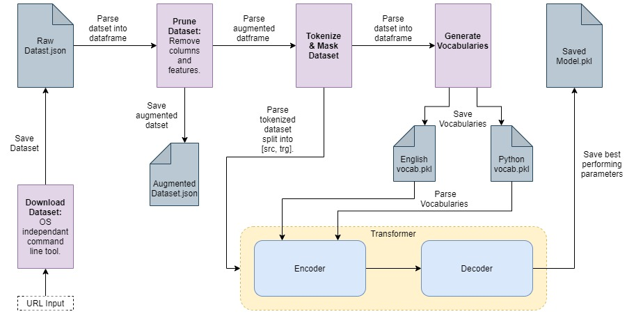
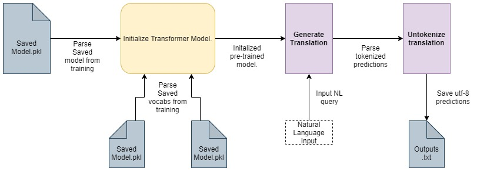

# Trans-CS

## Pre-requisites:

* Python 3.8 or above
* anacoda

Please use the conda environment provided. Alternatively, you can download the packages manually using pip.

## Run on Demo Dataset:
In the console of your choice write the following commands to run `Trans-CS`

1. python .\Datasets\download_dataset.py -u http://www.phontron.com/download/conala-corpus-v1.1.zip
2. python .\Preprocess\preprocess_dataset.py
3. python .\train.py
4. python .\eval.py
